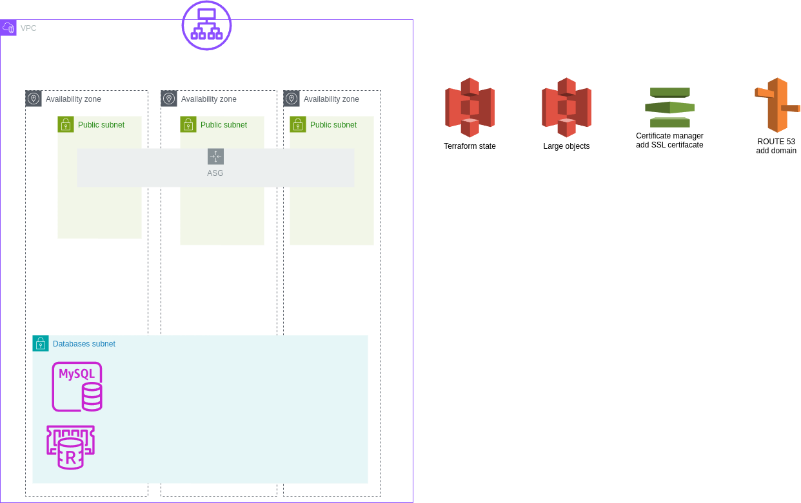
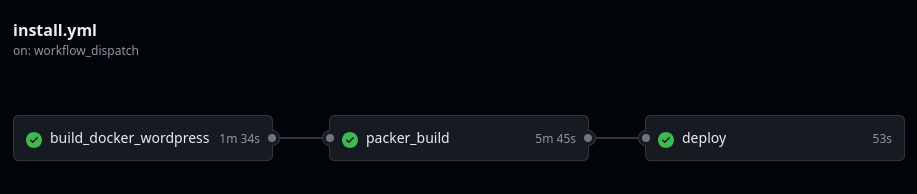

# Install WordPress

Site: 
https://wordpress-for-test.pp.ua


## Schema of Installation




Not implemented:

    Use of S3 for large objects;
    CDN;
    Real-life testing

---
## Description
For automation deploy you need: 
- manual create all steps in "part #1" 
- setup variables in /terraform/variables.tf 

## Part #1: Manual Setup

### Step 1.1: Create AWS Account
- Sign up for an AWS account if you don't have one.

### Step 1.2: Create S3 Bucket for Terraform State
- Create an S3 bucket to store your Terraform state.
- Consider using DynamoDB for state locking to prevent concurrent Terraform executions (this will be addressed later).

### Step 1.3: Setup Secrets in GitHub
- Add AWS credentials to GitHub Secrets for secure access.

### Step 1.4: Configure AWS Credentials
- Use the AWS Console to set up credentials for:
  - Docker Hub
  - Database and wp-admin (remember to configure usernames for the database and WordPress later).

### Step 1.5: Create SSH Key for EC2 Instance
- Generate an SSH key for your EC2 instance.
- (Note: It’s recommended to use Terraform for this, but you can skip regeneration if you already have a key.)

- By the whay: you will need this key for create DB on RDS-MySQL server... 

---

## Part #2: Terraform

1. Run the following commands:
   ```bash
   cd terraform
   terraform init
   terraform apply

### after this moment you will created:
- vpc..
- subnets..
- rds mysql 
- elastice cache REDIS
- bastion host for create database and users for wordpress.. )
- other .... 
P.S. don't forgot to setup variables  )) 

## Part #3: CI/CD


### Step 3.1: Create Docker Container
- **Objective**: Build a Docker container with the WordPress source code.
- **Action**:
  - Push the Docker container to Docker Hub.
- **Benefits of using container**:
  - Isolation of the site.
  - Facilitates future migrations.

### Step 3.2: Create AMI Image
- **Source**: Utilize `blank-wordpress-code` from a GitHub repository (unzip the archive from WordPress.org).
- **Note**: WordPress requires database connections (MySQL and Redis) to function properly when deployed within AWS.

#### Use the Installation Script
- **Script Path**: `/packer/scripts/install_wordpress.md`
- **Installation Tasks**:
  - Set up the database.
  - Set up Redis.
  - Set up HTTPS plugin (currently not functional; ongoing work).
  - Set up S3 (to be addressed within 1-2 days).

> **Note**: We can use the source code with installed plugins, but the functionality without prior setup is uncertain.

### Step 3.3: Deployment
- **Objective**: Implement green/blue deployment strategy.
- **Action**: Switch running instances in the Auto Scaling Group (ASG) to ensure zero downtime during updates.
